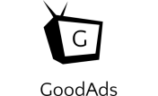

  
  <h1>GoodAds - Free Ad Service for Non Profits</h1>
  

    GoodAds is a free advertisement platform for Non Profits. The objective behind GoodAds is to help Non Profits raise more funding by reaching out to a wider audience, especially in times of crisis like we COVID19 has presented, without shelling out huge amounts of money on ad campaigns and digital advertising agencies, a luxury a lot of Non Profits cannot afford. Instead, with GoodAds, Non Profits can sign up with as advertisers and we charge the Non Profit with a small percentage of the funds they raise through our ads.   
  

## Table of Contents

1. [Introduction](#introduction)
2. [Key Players](#keyplayers)
3. [Meet The Team](#core-team)
4. [About](#about)
5. [Credits](#credits)

<h2 align="center">Introduction</h2>

Non Profits undertake work that is important for the society and they truly help make our world a better place. As such, at a lot of Non Profits, there aren't a lot of funds to spare for publicity and expensive ad campaings. However, getting their word out and raising more funding for their initiatives is also essential for them to function. Good Ads aims to solve this problem by developing an ad platform where the barrier to entry is \$0, unlike other platforms like GoogleAds and FacebookAds where a significant upfront investment is required.

**TL;DR**

- Advertisers(Non Profits) can start running ads free of charge through GoodAds
- Publishers(People who run any kind of website - blogs, news, trivia) display our ads on their website just like any other ad service
- Visitors (Users who visit a Publisher's website) see these ads and may make a donation to a Non Profit
- GoodAds keeps a small percentage(say 5%) of the donation to run the platform and pay the publishers

Essentially, GooAds is itself a Non Profit that only charges a nominal amount for the ads _after_ a Non Profit raises money and uses it to run the infrastructure to pay the publishers.

<h2 align="center">Key Players</h2>
Let's take a look at the key players in our ecosystem to understand the platform better.

1. Advertisers - the non profits who want to raise funds

- They can run ads without paying a single penny upfront
- When they sign up with GoodAds, a dedicated webpage is generated for every advertiser which showcases the Non Profit's impact, goals
- The webpage also offers payment integration for donations so people who want to donate funds to a Non Profit can do so quickly and securely.
- The advertisers are charged a small percentage of _funds they raise_. This fee is used to run the GoodAds infrastructure and pay the publishers.

2. Publishers

- If you run a website on the internet and have some user traffic, like a cooking blog, an entertainment site, or a online fitness studio, you can sign up with us and show ads to your users.
- Publishers are paid on the basis of the number of ads their visitors click on and the number of ads clicks that lead to a donation to the Non Profit.
- The ads are unobtrusive and do not track the users' activities across the web.
- Getting started with serving ads is easy. All a publisher needs to do it embed a script on their webpage, and they are good to go
- Publishers can also log in to the Publisher's Dashboard at any point of time and see statistics like ad impressions on their websites, donations made through ads on their websites and of course, their ad revenue.

3. Visitors -

- A visitor is any person who might stumble across a publisher's website.
- These visitors, fed up with the same old ads of some product they saw on Amazon a few days ago, instead see an ad for a non profit around them which is doing meaningful work to uplift the society.
- Visitors can follow this ad to the non profits GoodAds page which showcases the Non Profits objectives, impact, ambitions and needs. After looking these details, the visitor can also choose to make a donation to the organization.

4. GoodAds

- We are a non profit ourselves and our objective is to empower other non profits with the funds they require to continue their work.
- Since we are not interested profit ourselves, we can get by with small charging the Non Profit a very small fee.
- This fee can then be used to pay our infrastructure bills, and pay our publishers.

<h2 align="center">Meet The Team</h2>
<table>
  <tbody>
    <tr>
      <td align="center" width="33%" valign="top">
        
         
        <a href="https://github.com/aritra24">Aritra Basu</a>
         
      </td>
      <td align="center" width="33%" valign="top">
        
         
        <a href="https://github.com/ekamwalia">Ekam Walia</a>
         
      </td>
      <td align="center" width="33%" valign="top">
        
         
        <a href="https://github.com/dylan007">Shounak Dey</a>
         
      </td>
     </tr>
  </tbody>
</table>

<h2 align="center">About</h2>
GoodAds was developed at HackNow, an online hackthon organized by CalHacks with MLH and Postman in April 2020 (yeah, the one with Covid). You can check out the

- [Devpost submission here](https://devpost.com/software/good-ad)

- [Demo video here](https://youtu.be/4dTG0-VJQ6I)

<h2 align="center">Credits</h2>
